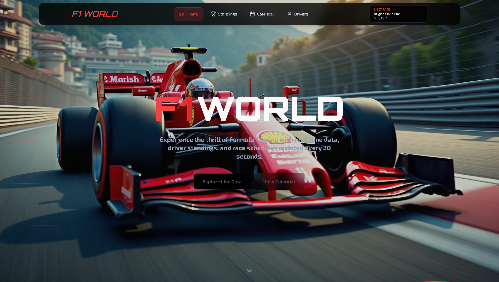

# 🏁 F1 World – Grand Prix Display

Your ultimate Formula 1 destination for real-time driver standings, race schedules, and detailed driver stats — built with modern frontend tools.

---

## 📸 

> Experience the thrill of Formula 1 racing with real-time data, updated every 30 seconds.

---

## ⚙️ Tech Stack

- ⚡ **Vite** – Fast frontend tooling  
- ⚛️ **React** – UI library  
- 🦾 **TypeScript** – Type safety  
- 🎨 **Tailwind CSS** – Utility-first CSS framework  
- 🧩 **lucide-react** – Icon library

---

## 🚀 Features

- Real-time **F1 driver standings**
- Interactive **race calendar** and schedules
- Detailed **driver profiles** and stats
- Fully **responsive** user interface
- Clean and **accessible** components with modern design

---

🏎 Built for F1 fans with speed and style.  
💬 Open to feedback and collaboration: [Connect on LinkedIn](https://www.linkedin.com/in/samarthmuktamath)
